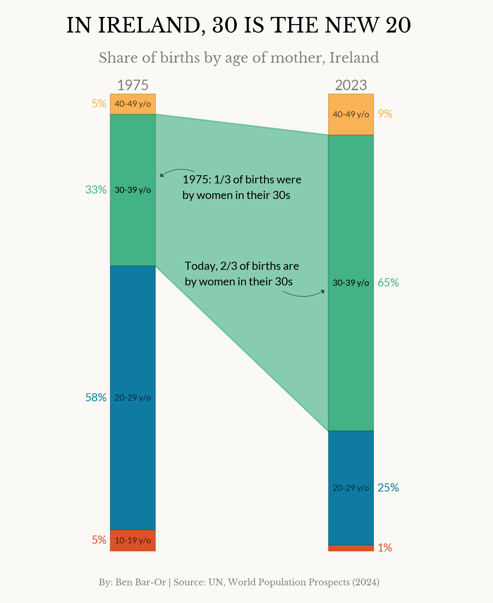

# Comparing births in Ireland by age groups 🍀👶🏻

This project visualizes the share of births in Ireland by the age of the mother at two points in time. The goal is to highlight one specific age group and show how the distribution of births in this group has changed over time.

📊 **Visualisation**  

This viz was a hands-on exercise in working with proportions to create a clear and minimal story using Python. 
Design choices such as label placement, color usage, and font hierarchy are made to emphasise the main insight the viz focuses on.

The data comes the UN World Population Prospects (2024) and all credit for the dataset goes to them.

📂 **How to explore**  
Open the Jupyter Notebook to see the full workflow: [births_share_ireland.ipynb](births_share_ireland.ipynb)

💡 **Key learning points / what I practiced:**  
- Clear and minimal storytelling
- Emphasis on proportion changes
- Using design as a function to support the main insight.
